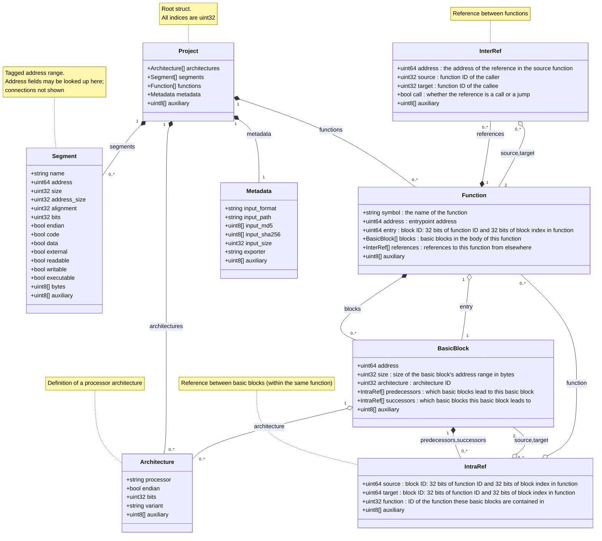

Diagram of Fugue's database, for comparing it to e.g. Ghidra.

Note of warning: [cardinality](https://mermaid.js.org/syntax/classDiagram.html#cardinality-multiplicity-on-relations) of connections might not be correct.

- Composition (filled diamond) means that the child is inside the parent data structure.
- Aggregation (unfilled diamond) means that the value stored can be used to find the child (like for example an address or an ID).

Based on the original revision of the database schema: https://github.com/fugue-re/fugue-db-schema/blob/10419ab5a06ac9ccbb4f2c101ff725b92e2ea389/fugue.fbs

